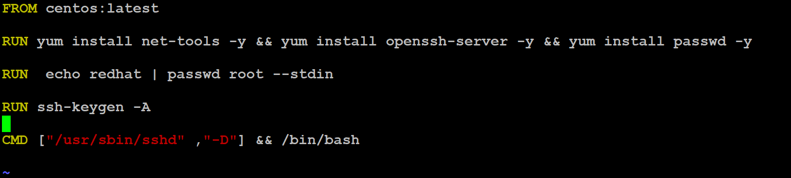
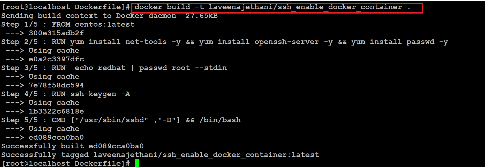
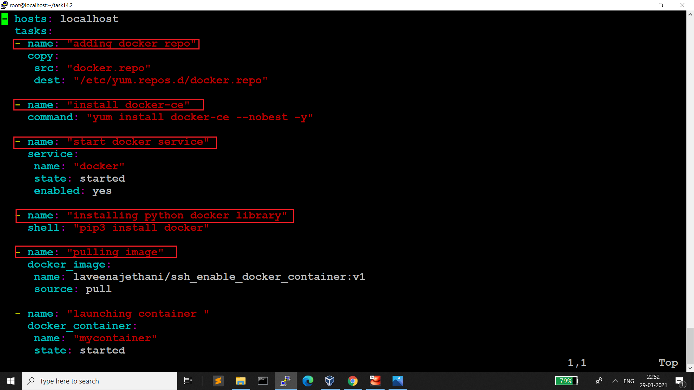
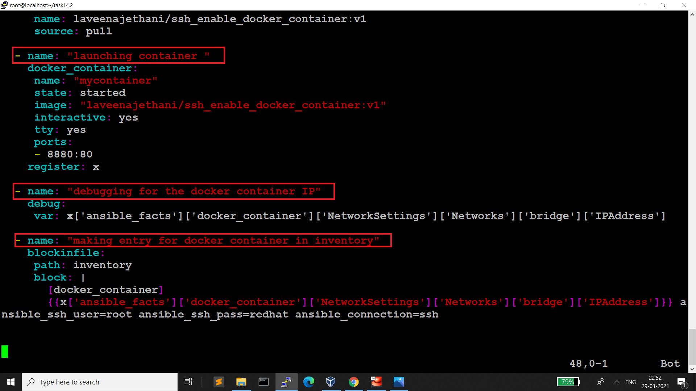
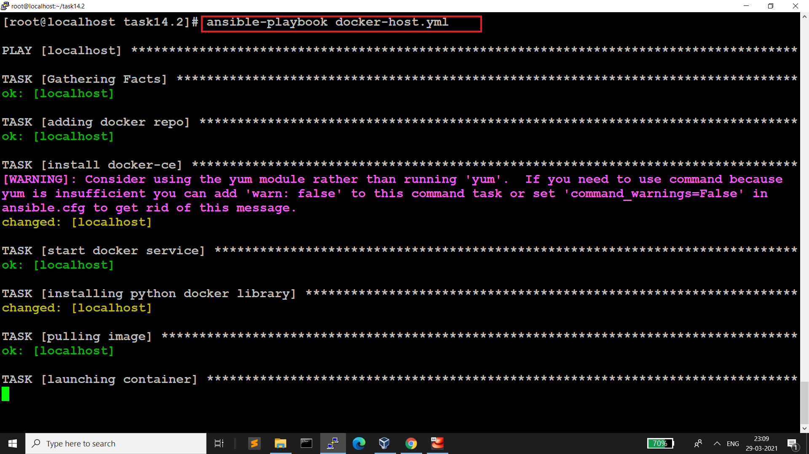
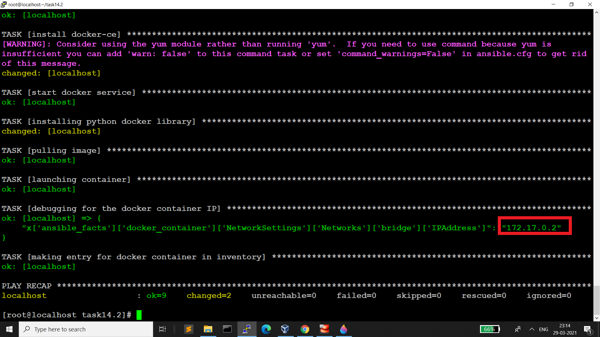
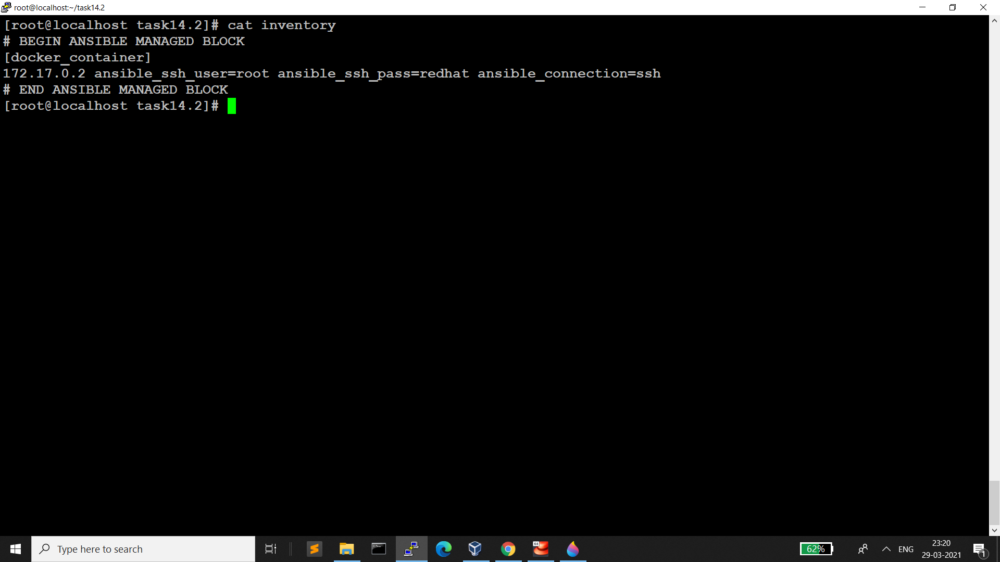
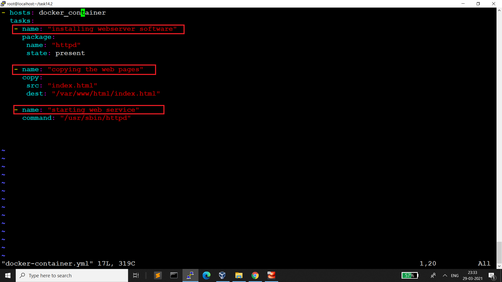
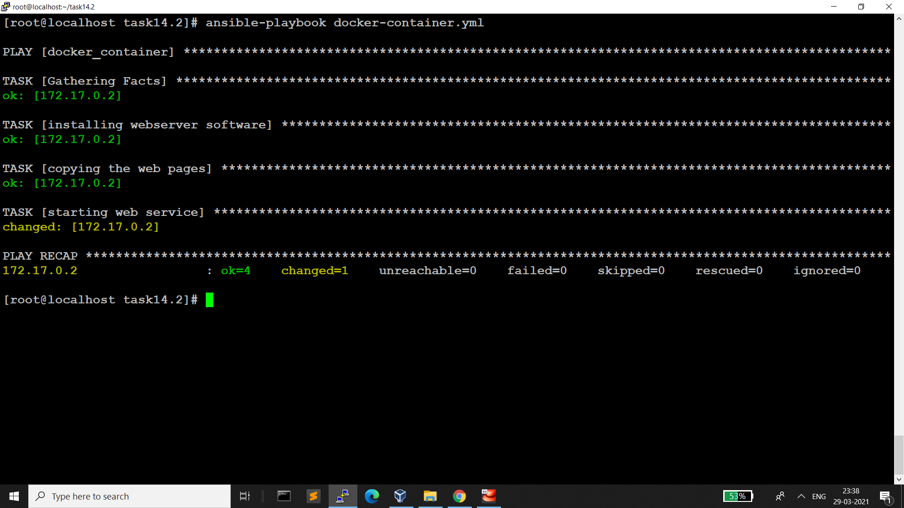

# Configure Webserver Inside Docker Container

**As we know that by default if we create container using centos image so inside docker container we can not do remote login using SSH but we can enable this feature.**

**I have created dockerfile and from this dockerfile I will create my own customize docker image so that we can do SSH login inside the docker container**

In workspace I have created on folder Dockerfile and inside this folder I have Dockerfile .

# Dockerfile 

**Let's build the docker image**

**I have created ansible playbook docker-host.yml . This playbook do following action:**
- install docker 
- Start docker service 
- Pull Image & launch container & expose the docker conatiner 
- Reterive docker container IP 
- Inside inventory mentioning docker container IP for further webserver configuration

**Let's run the playbook docker-host.yml**

**After runnning dicker-host.yml this playbook has been configured inventory file for mention docker container IP**

**I have created docker-container.yml playbook this playbook will configure webserver inside docker container**

**Let's run the playbook docker-container.yml**

**As previously while launching the container I have mentioned in docker-host.yml file container will expose at port 8880 so let's run the website on the browser and see the output**

# Successfully Setup Webserver Inside Docker Container
